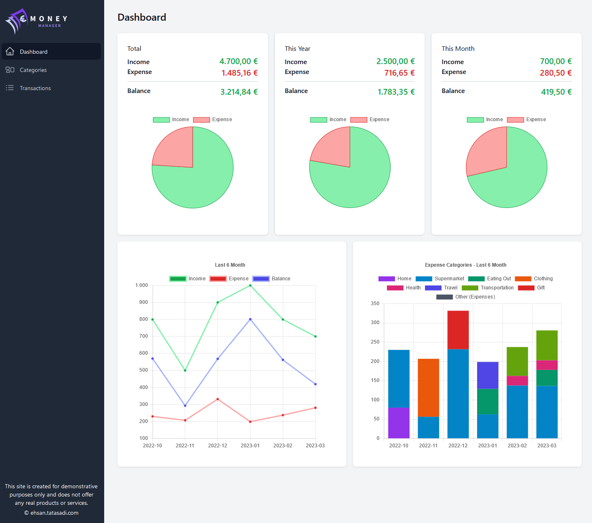

# React Money Manager

Would you like to manage your income and expenses in one app? If yes, this app is for you!
You can add different income and expense categories. After that you can start add transactions and see an overview of your income and expenses in dashboard.

You can see the demo of the app [here](http://moneymanager.projects.tatasadi.com/).

For demonstrative purposes some data is added to the app.

## Quick Start

Download the repo and run the following commands:

```bash
npm install
npm run dev
```

This project is built with [Vitejs](https://vitejs.dev/) and [Tailwind](https://tailwindcss.com/).

Screenshot of the app:


